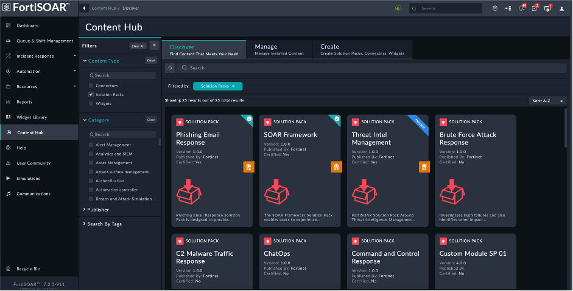
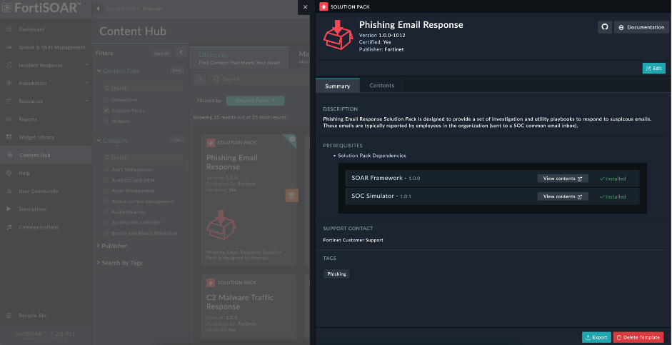

# Deploying a Solution Pack

1. Log on to your FortiSOAR instance
2. Navigate to **Content Hub** 
   
3. Select ** Solution Packs** from filters to choose solution pack and select solution pack that you want to see its details.
     

2. On the solution pack's page, choose the solution pack you want to deploy and install.

Once the install is successfully completed, you can use the solution pack.
