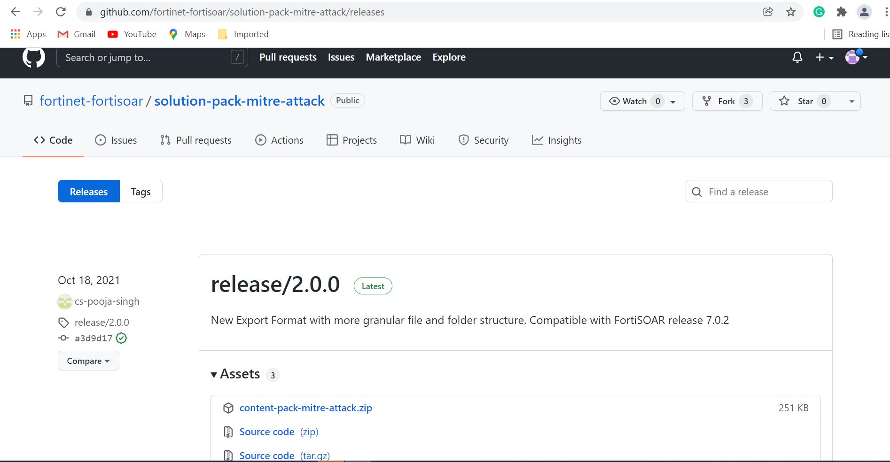
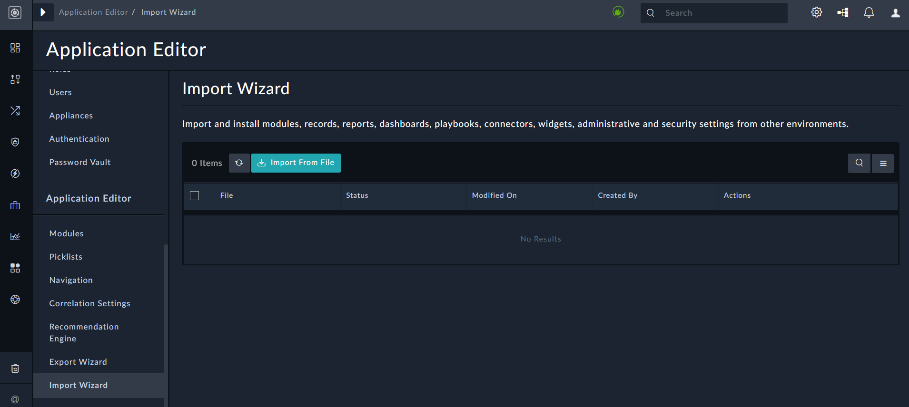

# Deploying a Solution Pack

1. Open the page of the solution pack that you want to deploy and click **Releases**, which displays the list of releases for that solution pack:  
   
2. On the solution pack's Releases page, choose the solution pack release you want to deploy and download the respective zip files.     
   
3. Log on to your FortiSOAR instance, and perform the following steps to import the solution pack:
    1. Click **System Settings** and then from the left-navigation, click **Import Wizard**  
        
    2. On the `Import Wizard` page, click **Import From File** and selected the solution pack zip that you have downloaded, and navigate through the Import Wizard.   
         
       **Note**: It is recommended not the change any configurations or options of the imported solution pack zip file.  

Once the import is successfully completed, you can use the solution pack.

